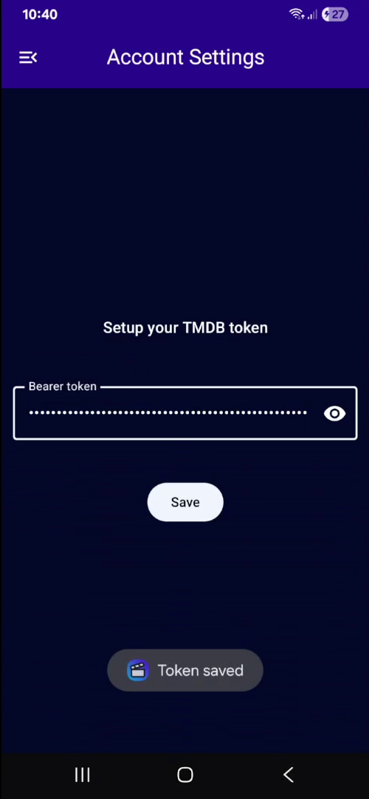
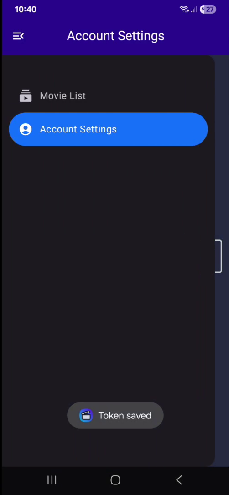
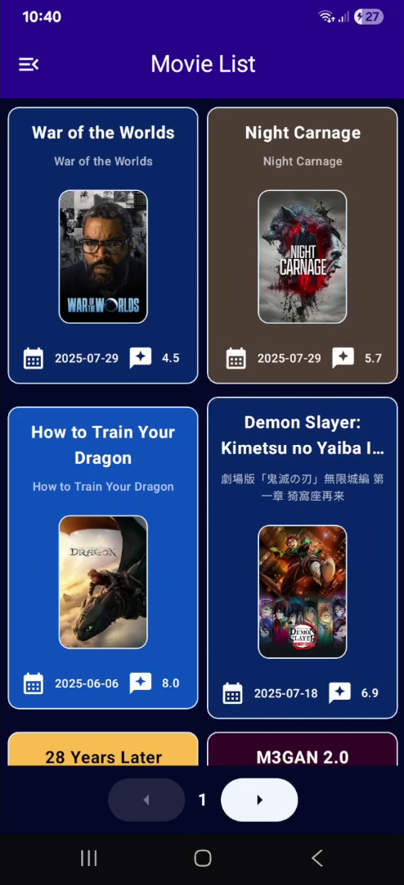
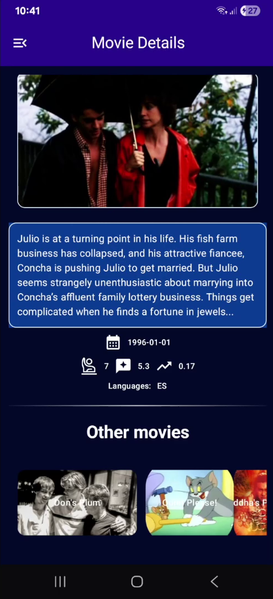

## Requirements to run
- Bearer token. This is set in the App. You can paste it into Google Keep (Google Notes) to copy paste
it more easily into your device
- Minimum Android version: 11 (API level 30)

# Project Specifications
## Screens
- **Movie List Screen**
    - Paginated list of movies
    - Each item displays:
    - Movie title
    - Original title
    - Release date
    - Vote average
    - Load more pagination
    - Loading state
- **Movie Detail Screen**
    - Movie backdrop image using: https://image.tmdb.org/t/p/w500{backdrop_path}
    - Movie title
    - Original title
    - Release date
    - Vote average
    - Vote count
    - Movie overview/description
    - Additional movie information (popularity, language, etc.)
    - Back navigation to list

## Evaluation Criteria
- **Mandatory (Must Have)**
    - ✔️ Kotlin implementation with proper language features
    - ✔️ Jetpack Compose UI with Material Design 3
    - ✔️ Clean Architecture with proper layer separation
    - ✔️ MVVM/MVI pattern with StateFlow state management
- **Valorized (Nice to Have)**
Hilt dependency injection with multiple modules
    - ✔️ Repository pattern with proper abstraction
    - ✔️ Use Cases for business logic encapsulation
    - ✔️ Compose Navigation with type-safe routing
    - ✔️ Comprehensive error handling and loading states
    - ✔️ Efficient pagination and data loading
    - ✔️ Responsive and accessible UI design

> [!NOTE]
> No library was indicated for the HTTP Client. So I chose [Ktor](https://ktor.io/docs/client-create-new-application.html). JFYI: Some legacy projects use Hilt with the anottation processor KAPT. The standart is now KSP [which is 2 times faster](https://kotlinlang.org/docs/ksp-overview.html).
>
> No library was indicated for loading Images from the API. There is still [no built-in way to load non-local-app Images](https://developer.android.com/develop/ui/compose/graphics/images/loading#internet-loading). So I chose [Coil](https://coil-kt.github.io/coil/)
> 
> I'm more used to and prefer Koin for Kotlin Injection. It's my first time using Hilt
>
> I used [version catalog](https://developer.android.com/build/migrate-to-catalogs) of the dependencies which is now the standard for organizing dependencies
> 
> All dependencies added are followed by "Added:"
> 
> Kotlin version used: 2.2.0 (set in `gradle/libs.versions.toml`)
> 
> I added a unit test to test the API in an initial phase (was done before starting the UI)

## API docs
- API rate limiting: 50 req/s - https://developer.themoviedb.org/docs/rate-limiting
- https://developer.themoviedb.org/reference/movie-now-playing-list

## Dates
- Challenge submitted to me at 11:27 (thursday) 31/7/2025
- Deadline date: 4/8/2025 (monday) in the evening
- Finished date: 2/U/2025 (saturday)
- Submission date: 4/8/2025 (monday) at 11:06

## Final result
### [Video preview here 🎥](https://mega.nz/file/bo51VDDS#65Y39lkLPTtosbJnhfLpNdJ7m0k3TXTcIpe0S_FNutE)

|  </img> |  </img>  |  </img>  |  </img>  |
|-------------------|---|---|---|

## Extra work done for the challenge
In addition to meeting all the requirements and evaluation criteria, I also added a section in the individual movie screen that can contain up to 5 random movies in a horizontal carousel format (sometimes it appears empty because it may be requesting a (random) ID that no longer exists in the API).

The app includes a navigation drawer that allows access to the movies screen and the Bearer token configuration screen so you can use the TMDB API.

The composables (UI) are well-structured, scalable, and dynamic based on the state of the data and its values. These are also abstracted from the View Model, allowing for previews (Compose Previews) of the screens in Android Studio. And the app's theme (color palette) is based on the [company] theme.

## Resources used
- https://developer.android.com/training/dependency-injection/hilt-android
- https://kotlinlang.org/docs/ksp-quickstart.html

> [!TIP]
> I had greats interviews with the HR recruiter, senior Android developer in the technical interview (nailed this interview) and with the CTO of the start-up. The company is not a B2B, it develops it's own product.
>
> Didn't get in, because they found someone with better "technology and experience" level. Even though the senior Android dev told me they really needed people (multiple persons).
>
> I was said that:
> 
> *There was some difficulty in making a decision, as we had several good candidates in the process. The team really enjoyed meeting you, and the feedback was positive. They said you stood by your work and provided good solutions to problems. You did several "extras" during the challenge, and you were very focused on safety, which left a good impression.*
>
> Fun fact: in the technical interview, when the senior dev opened up his emulator, out of the multiple "movie" apps installed in his grid of apps, mine was the only one with an icon. This, plus UI/UX concerns, composable previews, extra screen for secret token setup, scalable architecture, video preview shared and doing the app in 3 days (with git history shared for proof) were apparently not enough.
>
> I am extremely proud of my work and commitment to this job assignment, but dissapointed with the lack of foresight someone saw in me, after proving that I deliver high quality work, quickly and that I even went beyond what was requested.
